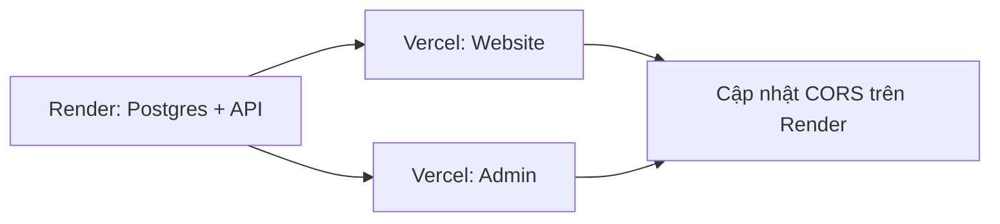

# Triển khai KIZUNA

| Thành phần | Nền tảng | Thư mục gốc |
|------------|----------|-------------|
| Website (khách) | [Vercel](https://vercel.com) | `web/website` |
| Admin | [Vercel](https://vercel.com) | `web/admin` |
| Backend API (Django) | [Render](https://render.com) | `web/backend` |
| Chatbot / SSE (tuỳ chọn) | Riêng | `web/chatbot` (nếu có) |

---

## 1. Backend — Render

### Tạo service

1. [Render Dashboard](https://dashboard.render.com) → **New** → **Blueprint** (import repo) hoặc **Web Service** thủ công.
2. Nếu dùng Blueprint: file `web/backend/render.yaml` (Postgres + API + disk media 1GB).
3. **Root Directory**: `web/backend`
4. **Build Command**: `./build.sh` (cần executable — xem bên dưới)
5. **Start Command**:  
   `gunicorn core.wsgi:application --bind 0.0.0.0:$PORT --workers 2`
6. **Health Check Path**: `/api/shop/exchange-rates/`

### Biến môi trường (Render)

| Biến | Mô tả |
|------|--------|
| `DJANGO_SECRET_KEY` | Chuỗi ngẫu nhiên (Render có thể generate) |
| `DJANGO_DEBUG` | `False` |
| `DJANGO_ALLOWED_HOSTS` | `kizuna-api.onrender.com` (hoặc tên service của bạn) |
| `DATABASE_URL` | Tự gán nếu dùng Render Postgres |
| `MEDIA_ROOT` | `/var/data/media` (khi mount disk) |
| `CORS_ALLOWED_ORIGINS` | URL Vercel website + admin, cách nhau bởi dấu phẩy |
| `CSRF_TRUSTED_ORIGINS` | Giống CORS (https, không slash cuối) |
| `SECURE_SSL_REDIRECT` | `True` |

**Ví dụ CORS** (thay domain thật sau khi deploy Vercel):

```text
https://kizuna-website.vercel.app,https://kizuna-admin.vercel.app
```

### Build script

Trên máy local (một lần):

```bash
chmod +x web/backend/build.sh
```

Commit `build.sh` với quyền thực thi hoặc trong Render set build:  
`chmod +x build.sh && ./build.sh`

### Media uploads

Disk Render mount tại `/var/data/media` — ảnh upload lưu tại đây. URL public:  
`https://<service>.onrender.com/media/...`

### Kiểm tra sau deploy

```bash
curl https://kizuna-api.onrender.com/api/shop/exchange-rates/
```

Phản hồi JSON với `usd_to_vnd`, `usd_to_jpy`, …

---

## 2. Website — Vercel

1. **Add New Project** → import Git repo.
2. **Root Directory**: `web/website`
3. **Framework**: Vite (hoặc để Vercel auto-detect + `vercel.json`).
4. **Environment Variables** (Production + Preview):

| Biến | Giá trị |
|------|---------|
| `VITE_API_BASE_URL` | `https://<render-host>.onrender.com/api` |
| `VITE_MEDIA_BASE_URL` | `https://<render-host>.onrender.com` |
| `VITE_APP_URL` | `https://<website>.vercel.app` |
| `VITE_CHAT_API_BASE_URL` | URL chatbot (nếu có) |
| `VITE_GEMINI_API_KEY` | Tuỳ chọn (Concierge) |

5. Deploy → copy URL → thêm vào `CORS_ALLOWED_ORIGINS` trên Render → redeploy backend nếu cần.

Mẫu biến: `web/website/.env.example` → copy thành `.env.local` khi dev.

---

## 3. Admin — Vercel

Giống website, **project riêng**:

1. **Root Directory**: `web/admin`
2. Biến `VITE_*` giống website (cùng backend Render).
3. `VITE_APP_URL` = URL admin Vercel.

Mẫu: `web/admin/.env.example`

SPA routing: `web/admin/vercel.json` rewrite về `index.html`.

---

## 4. Chatbot (tuỳ chọn)

Admin Chat và thông báo realtime dùng service riêng (mặc định dev: `http://localhost:8080/api`).

- `VITE_CHAT_API_BASE_URL` trên **cả** website và admin trỏ tới service chat đã deploy.
- Nếu chưa deploy: để trống hoặc không set — các màn chat/SSE sẽ không kết nối được.

---

## 5. Thứ tự triển khai đề xuất



1. Deploy **backend** Render → lấy URL API.
2. Deploy **website** và **admin** Vercel với `VITE_API_BASE_URL` / `VITE_MEDIA_BASE_URL`.
3. Cập nhật **CORS** + **CSRF** trên Render với 2 URL Vercel.
4. (Tuỳ chọn) Deploy chatbot và set `VITE_CHAT_API_BASE_URL`.

---

## 6. Dev local

```bash
# Backend
cd web/backend && python manage.py runserver

# Website
cd web/website && cp .env.example .env.local && npm run dev

# Admin
cd web/admin && cp .env.example .env.local && npm run dev
```

Mặc định frontend trỏ `http://127.0.0.1:8000` nếu không set `VITE_*`.

---

## 7. Lưu ý

- **Free tier Render**: service sleep sau idle — request đầu có thể chậm ~30s.
- **SECRET_KEY**: không dùng giá trị dev trên production.
- **Không commit** `.env.local` — chỉ `.env.example`.
- Hai project Vercel = hai domain; cả hai phải nằm trong `CORS_ALLOWED_ORIGINS`.
